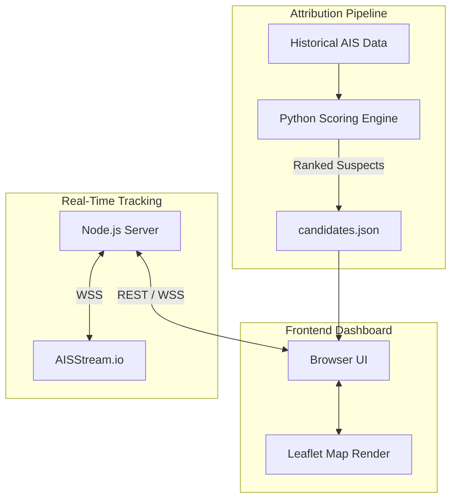

<div align="center">

# 🌊 AquaTrace

**Advanced Satellite Oil Spill Detection & AIS Vessel Correlation Engine**

<p>
  <a href="https://github.com/GhostPointerX/AquaTrace/stargazers"></a>
  <a href="https://github.com/GhostPointerX/AquaTrace/network/members"></a>
  <a href="https://github.com/GhostPointerX/AquaTrace/issues"></a>
  <a href="https://opensource.org/licenses/MIT"></a>
</p>

</div>

<br />

## 📖 Overview

**AquaTrace** is an intelligent, high-performance platform designed to track, analyze, and attribute marine oil spills. By synthesizing **Sentinel-1 Synthetic Aperture Radar (SAR)** satellite imagery with **real-time Automatic Identification System (AIS)** vessel trajectories, AquaTrace automatically detects oil slicks and runs a sophisticated 5-factor scoring model to rank likely polluting vessels.

Whether for environmental protection agencies, maritime law enforcement, or research institutions, AquaTrace provides an unprecedented level of insight into maritime incidents.

---

## ✨ Features

<table>
  <tr>
    <td width="50%">
      <h3>📡 Real-Time Live Tracking</h3>
      <p>Connects to global AIS streams via WebSockets to visualize thousands of active ships worldwide in real-time, providing immediate situational awareness.</p>
    </td>
    <td width="50%">
      <h3>⚖️ Advanced Attribution Engine</h3>
      <p>Powered by Python, our 5-factor heuristic algorithm evaluates Spatial Proximity, Temporal Proximity, Trajectory Alignment, Drift, and Behavioral Anomalies to calculate a confidence score (0-100) for every suspect vessel.</p>
    </td>
  </tr>
  <tr>
    <td width="50%">
      <h3>🗺️ Brutalist Interactive UI</h3>
      <p>A beautiful, modular dashboard built with Vanilla JavaScript, Leaflet.js, and a bespoke brutalist design system (TailwindCSS) for rapid, intuitive data exploration.</p>
    </td>
    <td width="50%">
      <h3>🛰️ Satellite SAR Integration</h3>
      <p>Cross-references precise coordinates and timestamps of detected oil spills (e.g., from Sentinel-1 imagery) to build precise backtrack drift paths.</p>
    </td>
  </tr>
</table>

---

## 🏗️ System Architecture

AquaTrace employs a decoupled, highly modular architecture combining a high-throughput Node.js streaming server with a rigorous Python data science backend.



---

## 🚀 Quick Start Guide

Getting AquaTrace running locally is incredibly simple. The project is split into three independent services.

### 1️⃣ Start the Real-Time Server (Node.js)
Powers the live global vessel tracker.

```bash
cd live_track_ship
npm install

# Setup environment variables
cp ../.env.example ../.env
# IMPORTANT: Edit ../.env and add your AISSTREAM_API_KEY

npm start
```
*The server will spin up on `http://localhost:3001`.*

### 2️⃣ Run the Attribution Engine (Python)
Processes historical AIS data to identify oil spill culprits.

```bash
cd aquatrace_ais
pip install -r requirements.txt

# Execute the 5-factor scoring model
python run_attribution.py
```
*Analyzed results are generated and stored in `outputs/attribution/candidates.json`.*

### 3️⃣ Launch the Dashboard
No build steps required for the UI. Just open the `index.html` file in your preferred modern web browser.

```bash
# MacOS
open frontend/index.html

# Windows
start frontend/index.html
```

---

## 📂 Project Structure

```text
AquaTrace/
├── frontend/                   # 🖥️ User Interface (Vanilla JS, CSS, Leaflet)
├── aquatrace_ais/              # 🧠 Python Attribution Analytics Engine
├── live_track_ship/            # 🌐 Node.js Live WebSocket Server
├── data/                       # 📁 Raw AIS input datasets
├── outputs/                    # 📊 Generated AI/Attribution reports
├── docs/                       # 📚 Architecture & System Documentation
└── scripts/                    # ⚙️ Utility startup scripts
```

---

## ⚙️ Configuration

Configure the environment by copying `.env.example` to `.env` in the root directory.

| Environment Variable | Required | Default | Description |
|----------------------|:--------:|---------|-------------|
| `AISSTREAM_API_KEY`  |   ✅   | *None*  | Your API key from AISStream.io |
| `PORT`               |   ❌   | `3001`  | Port for the Node.js backend |
| `VESSEL_STALE_TIMEOUT_MS` | ❌ | `7200000` | Timeout (2 hours) before dropping stale vessels |

---

## 🤝 Contributing

We welcome contributions from the community! If you're interested in improving AquaTrace:
1. Fork the repository
2. Create a feature branch (`git checkout -b feature/AmazingFeature`)
3. Commit your changes (`git commit -m 'Add some AmazingFeature'`)
4. Push to the branch (`git push origin feature/AmazingFeature`)
5. Open a Pull Request

---

<div align="center">
  <p>Built with 🩵 for the oceans.</p>
  <p>&copy; 2026 AquaTrace Team</p>
</div>
