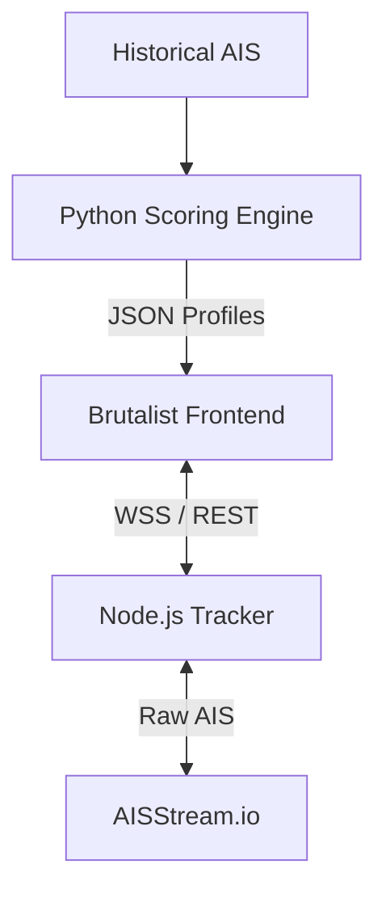

<div align="center">
  
  <h1>AquaTrace 🌊</h1>
  <p><strong>Who spilled the oil? Let's look at the data.</strong></p>

  <p>
    <a href="https://github.com/GhostPointerX/AquaTrace/stargazers"></a>
    <a href="https://opensource.org/licenses/MIT"></a>
  </p>
</div>

<br />

## The Problem
A dark patch appears on a Sentinel-1 satellite image. It's an oil slick. But by the time the satellite captures it, the ship responsible is long gone. 

## The Solution
**AquaTrace** correlates static SAR (Synthetic Aperture Radar) satellite imagery with dynamic, real-time AIS (Automatic Identification System) vessel trajectories. We backtrack the oil slick's drift, overlay historical ship tracks, and run a 5-factor scoring model to mathematically isolate the culprit.

No guessing. Just data.

---

## 🛠 Under the Hood

<table>
  <tr>
    <td width="50%">
      <h3>📡 Live AIS Radar</h3>
      <p>We hook directly into WebSocket AIS streams to track global ship movements in real-time. Built on Node.js for high-throughput stream processing.</p>
    </td>
    <td width="50%">
      <h3>🧠 5-Factor Attribution</h3>
      <p>A Python-powered heuristic engine that scores suspect vessels based on Spatial Proximity, Temporal overlap, Trajectory, Drift vectors, and AIS dark-activity (gaps/anomalies).</p>
    </td>
  </tr>
  <tr>
    <td width="50%">
      <h3>🗺️ Brutalist UI</h3>
      <p>A no-nonsense, hardware-accelerated map interface. Vanilla JS, Leaflet.js, and a bespoke brutalist design system using TailwindCSS. It's fast, modular, and looks badass.</p>
    </td>
    <td width="50%">
      <h3>🛰️ SAR Integration</h3>
      <p>Pinpoint accuracy. Cross-reference precise coordinates and timestamps of detected oil spills directly onto the maritime grid.</p>
    </td>
  </tr>
</table>

---

## 🏗 Architecture

A decoupled, three-tier setup:



---

## 🚀 Get Started

AquaTrace is split into three independent services. Run what you need.

### 1. The Tracker (Node.js)
Fires up the WebSocket listener for live global tracking.
```bash
cd live_track_ship
npm install
cp ../.env.example ../.env  # Add your AISSTREAM_API_KEY here
npm start
```
*Listens on `localhost:3001`.*

### 2. The Engine (Python)
Crunches historical data to find the polluter.
```bash
cd aquatrace_ais
pip install -r requirements.txt
python run_attribution.py
```
*Dumps results into `outputs/attribution/candidates.json`.*

### 3. The Dashboard (Frontend)
No build steps. No Webpack. Just pure frontend. 
Open `frontend/index.html` in any modern browser and you're good to go.

---

## 🤝 Want to help?

We like pull requests. Read our [CONTRIBUTING.md](CONTRIBUTING.md) to get the local setup running, pick an issue, and submit a PR.

<br>
<div align="center">
  <p>Built for the oceans. Open sourced for everyone.</p>
</div>
