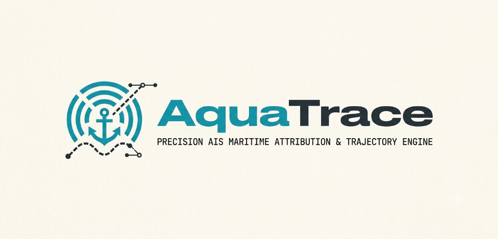
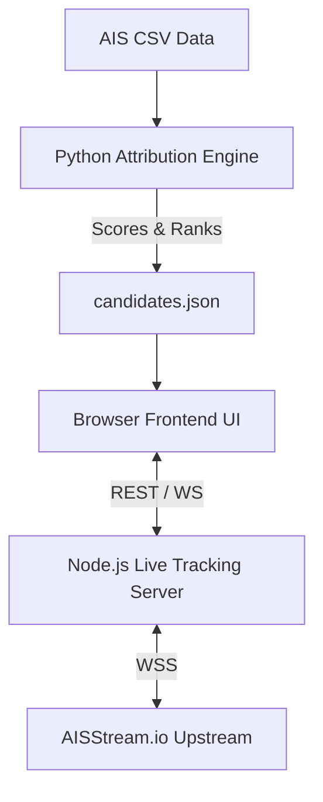

<div align="center">
  

  <br />
  <br />

  **High-Precision AIS Maritime Attribution & Trajectory Engine**

  <p>
    <a href="https://github.com/GhostPointerX/AquaTrace/stargazers"></a>
    <a href="https://github.com/GhostPointerX/AquaTrace/network/members"></a>
    <a href="https://github.com/GhostPointerX/AquaTrace/issues"></a>
    <a href="https://opensource.org/licenses/MIT"></a>
  </p>
</div>

<br />

## 📖 Executive Overview

**AquaTrace** is an advanced, high-performance platform designed to track, analyze, and attribute marine oil spills. By synthesizing **Sentinel-1 Synthetic Aperture Radar (SAR)** satellite imagery with **real-time Automatic Identification System (AIS)** vessel trajectories, AquaTrace automatically detects oil slicks and runs a sophisticated 5-factor scoring model to rank likely polluting vessels.

Built for environmental protection agencies, maritime law enforcement, and research institutions, AquaTrace provides unprecedented transparency into maritime incidents.

---

## ✨ Core Capabilities

| Feature | Description |
| :--- | :--- |
| **📡 Real-Time Global Tracking** | Ingests live WebSocket AIS streams to visualize thousands of active ships worldwide in real-time, providing immediate situational awareness. |
| **⚖️ Advanced Attribution Engine** | Powered by a Python 5-factor heuristic algorithm evaluating *Spatial Proximity*, *Temporal Overlap*, *Trajectory Alignment*, *Drift Vectors*, and *Behavioral Anomalies*. |
| **🗺️ High-Fidelity Interactive UI** | A highly modular, beautiful dashboard built with Vanilla JavaScript, Leaflet.js, and a bespoke brutalist design system using TailwindCSS. |
| **🛰️ Satellite SAR Integration** | Cross-references the precise coordinates and timestamps of detected oil spills directly onto the maritime tracking grid. |

---

## 🏗️ System Architecture

AquaTrace employs a highly decoupled, modular architecture combining a high-throughput Node.js streaming server with a rigorous Python data science backend.



---

## 🛠️ Technology Stack

- **Frontend Interface:** HTML5, Vanilla JavaScript, TailwindCSS, Leaflet.js
- **Real-Time Backend:** Node.js, Express.js, `ws` (WebSockets)
- **Analytics Engine:** Python 3.9+, Pandas, NumPy

---

## 📂 Project Structure

```text
AquaTrace/
├── assets/                     # 🎨 Branding and imagery
├── frontend/                   # 🖥️ User Interface (Vanilla JS, CSS, Leaflet)
├── aquatrace_ais/              # 🧠 Python Attribution Analytics Engine
├── live_track_ship/            # 🌐 Node.js Live WebSocket Server
├── data/                       # 📁 Raw AIS input datasets
├── outputs/                    # 📊 Generated AI/Attribution reports
├── docs/                       # 📚 Architecture & System Documentation
└── scripts/                    # ⚙️ Utility startup scripts
```

---

## 🚀 Quick Start Guide

Getting AquaTrace running locally is incredibly simple. The project is split into three independent services.

### 1️⃣ Start the Real-Time Server (Node.js)

```bash
cd live_track_ship
npm install

# Setup environment variables
cp ../.env.example ../.env
# IMPORTANT: Edit ../.env and add your AISSTREAM_API_KEY

npm start
```
*The server will spin up on `http://localhost:3001`.*

### 2️⃣ Run the Attribution Engine (Python)

```bash
cd aquatrace_ais
pip install -r requirements.txt

# Execute the 5-factor scoring model
python run_attribution.py
```
*Analyzed results are generated and stored in `outputs/attribution/candidates.json`.*

### 3️⃣ Launch the Dashboard (Frontend)

No build steps required for the UI. Just open the `index.html` file in your preferred modern web browser.

```bash
# MacOS
open frontend/index.html

# Windows
start frontend/index.html
```

---

## ⚙️ Configuration

Configure the environment by copying `.env.example` to `.env` in the root directory.

| Environment Variable | Required | Default | Description |
|----------------------|:--------:|---------|-------------|
| `AISSTREAM_API_KEY`  |   ✅   | *None*  | Your API key from AISStream.io |
| `PORT`               |   ❌   | `3001`  | Port for the Node.js backend |
| `VESSEL_STALE_TIMEOUT_MS` | ❌ | `7200000` | Timeout (2 hours) before dropping stale vessels |

---

## 🤝 Contributing

We welcome contributions! Please see our [Contributing Guidelines](CONTRIBUTING.md) for details on submitting pull requests and reporting issues. Ensure you also review our [Code of Conduct](CODE_OF_CONDUCT.md).

## 📄 License

This project is licensed under the MIT License - see the [LICENSE](LICENSE) file for details.

<div align="center">
  <p>&copy; 2026 AquaTrace Team</p>
</div>
